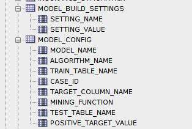
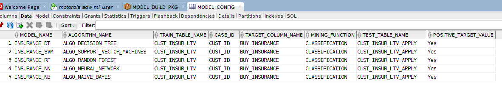
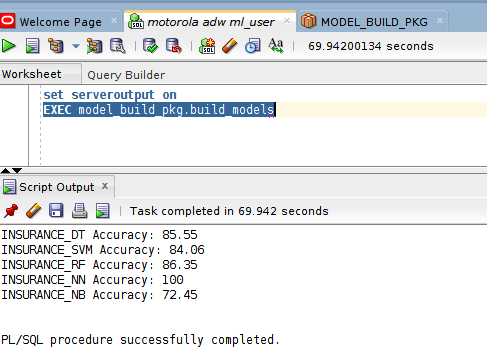

# Oracle PL/SQL Packages to Automate Oracle Machine Learning Model Builds

There are several good examples and tutorials/workshops that show how to write sql and pl/sql that create machine learning models.  To simplify the process this package was created as a stored procedure, that when invoked creates and populates a settings table, a configuration table, and then provides a second procedure to build the machine learning artifacts (models, lift tables, apply tables, and confusion matrix tables).  The process is as follows.  Note it assumes you create ML user "ml_user".

Once set up, you would just do the following for a new project:
- update your model settings and specify the table, target column, algorithm, case_id, etc. and execute the build ("exec model_build_pkg.build_models"), which would generate the code and run the build.

## **Step 1:** Grant user privileges

- Normally dm\_role (or oml\_developer) roles are sufficient to build models.  However when pl/sql is executed in stored procedures the grants must be direct and not through a role.  Execute the following grants from admin (or sys in dbcs) to ml\_user (or other ml user name).
```
<copy>grant unlimited storage to ml_user;
grant execute on dbms_data_mining to ml_user;
grant create mining model to ml_user;
grant create table to ml_user;</copy>
```

## **Step 2:** Compile the package.

- Copy/paste the code block below into sqlplus or sqldeveloper.  The code is at the bottom of this page.


## **Step 3:** Execute the create_config procedure.

- Execute the create_config procedure.
```
<copy>exec model_build_pkg.create_config;</copy>
```


- This creates and populates the MODEL\_BUILD\_SETTINGS table (normally used in ML builds) and a MODEL\_CONFIG table.  **This procedure only needs to be run once.  If it is re-run it drops and creates and re-populates the tables.  You must review the contents and adjust to your particular case.  The existing values are only used as a sample.**



- The MODEL\_BUILD\_SETTINGS table has the following values.  Note in this particular case a text index was used and therefore has text index settings - these would not normally be required and you can remove those rows.


- The MODEL\_CONFIG table has the following values.  The model build procedure (run next) loops through this table and builds a model for each row (in this case five models and related tables are built.  You must update this table with your own values.



## **Step 4:** Execute the build_models procedure.

- If you have not first run the create_config procedure you will be notified as such.
```
<copy>set serveroutput on
exec model_build_pkg.build_models;</copy>
```


- Now that you have created and updated the configuration you can build the models.  This may take some time, depending on the number of models and the data volume.
```
<copy>exec model_build_pkg.build_models;</copy>
```




## **Code - Compile This**

- Enter this in SQL Developer.
```
<copy>
CREATE OR REPLACE PACKAGE model_build_pkg IS
---------------------------------------------
	PROCEDURE create_config;
	PROCEDURE build_models;
END model_build_pkg;
/

CREATE OR REPLACE PACKAGE BODY model_build_pkg AS
---------------------------------------------
PROCEDURE create_config AS 
BEGIN
-- admin needs to: grant create table to ml_user

begin
execute immediate 'DROP table model_build_settings';
exception when others then null;
end;

execute immediate 'create table model_build_settings (setting_name varchar2(30),setting_value varchar2(4000))';

execute immediate 'insert into model_build_settings values (''ALGO_NAME'', ''ALGO_DECISION_TREE'')';
execute immediate 'insert into model_build_settings values (''PREP_AUTO'', ''ON'')';
execute immediate 'insert into model_build_settings values (''ODMS_TEXT_POLICY_NAME'',''MY_POLICY'')';
execute immediate 'insert into model_build_settings values (''TREE_TERM_MAX_DEPTH'', 7)';
execute immediate 'insert into model_build_settings values (''TREE_TERM_MINREC_SPLIT'', 20)';
execute immediate 'insert into model_build_settings values (''TREE_TERM_MINPCT_SPLIT'', .1)';
execute immediate 'insert into model_build_settings values (''TREE_TERM_MINREC_NODE'', 10)';
execute immediate 'insert into model_build_settings values (''TREE_TERM_MINPCT_NODE'', 0.05)';
commit;

begin
execute immediate 'DROP table model_config';
exception when others then null;
end;

execute immediate 'create table model_config ( '||
'model_name				varchar2(100) '||
', apply_table_name			varchar2(100) '||
', lift_table_name			varchar2(100) '||
', algorithm_name			varchar2(100) '||
', train_table_Name			varchar2(100) '||
', build_settings_table_name	varchar2(100) '||
', case_id				varchar2(100) '||
', target_column_name		VARCHAR2(100) '||
', mining_function			VARCHAR2(100) '||
', test_table_name			VARCHAR2(100) '||
', positive_target_value		VARCHAR2(100) '||
', confusion_matrix_table_name VARCHAR2(100))';

execute immediate 'insert into model_config values(''ALL_CASES_DT'',''ALL_CASES_APPLY_RESULT_DT'',''ALL_CASES_LIFT_DT'',''ALGO_DECISION_TREE'',''ALL_CASES_TRAIN_T'',''MODEL_BUILD_SETTINGS'',''INCIDENT_NUMBER'',''CATEGORIZATION_TIER_2'',''CLASSIFICATION'',''ALL_CASES'',''SW'',''ALL_CASES_CONFUSION_MATRIX_DT'')';
execute immediate 'insert into model_config values(''ALL_CASES_SVM'',''ALL_CASES_APPLY_RESULT_SVM'',''ALL_CASES_LIFT_SVM'',''ALGO_SUPPORT_VECTOR_MACHINES'',''ALL_CASES_TRAIN_T'',''MODEL_BUILD_SETTINGS'',''INCIDENT_NUMBER'',''CATEGORIZATION_TIER_2'',''CLASSIFICATION'',''ALL_CASES'',''SW'',''ALL_CASES_CONFUSION_MATRIX_SVM'')';
execute immediate 'insert into model_config values(''ALL_CASES_RF'',''ALL_CASES_APPLY_RESULT_RF'',''ALL_CASES_LIFT_RF'',''ALGO_RANDOM_FOREST'',''ALL_CASES_TRAIN_T'',''MODEL_BUILD_SETTINGS'',''INCIDENT_NUMBER'',''CATEGORIZATION_TIER_2'',''CLASSIFICATION'',''ALL_CASES'',''SW'',''ALL_CASES_CONFUSION_MATRIX_RF'')';
execute immediate 'insert into model_config values(''ALL_CASES_NN'',''ALL_CASES_APPLY_RESULT_NN'',''ALL_CASES_LIFT_NN'',''ALGO_NEURAL_NETWORK'',''ALL_CASES_TRAIN_T'',''MODEL_BUILD_SETTINGS'',''INCIDENT_NUMBER'',''CATEGORIZATION_TIER_2'',''CLASSIFICATION'',''ALL_CASES'',''SW'',''ALL_CASES_CONFUSION_MATRIX_NN'')';
execute immediate 'insert into model_config values(''ALL_CASES_NB'',''ALL_CASES_APPLY_RESULT_NB'',''ALL_CASES_LIFT_NB'',''ALGO_NAIVE_BAYES'',''ALL_CASES_TRAIN_T'',''MODEL_BUILD_SETTINGS'',''INCIDENT_NUMBER'',''CATEGORIZATION_TIER_2'',''CLASSIFICATION'',''ALL_CASES'',''SW'',''ALL_CASES_CONFUSION_MATRIX_NB'')';
commit;

END create_config;

---------------------------------------------

PROCEDURE build_models IS 

TYPE model_config_rt IS RECORD (
model_name				varchar2(100)
, apply_table_name			varchar2(100)
, lift_table_name			varchar2(100)
, algorithm_name			varchar2(100)
, train_table_Name			varchar2(100)
, build_settings_table_name	varchar2(100)
, case_id					varchar2(100)
, target_column_name		VARCHAR2(100)
, mining_function			VARCHAR2(100)
, test_table_name			VARCHAR2(100)
, positive_target_value		VARCHAR2(100)
, confusion_matrix_table_name VARCHAR2(100));

TYPE model_config_aat IS TABLE OF model_config_rt INDEX BY PLS_INTEGER;
 
l_model_config   model_config_aat;
   
v_accuracy number;

BEGIN

-- test to see if the config table has been created

BEGIN
EXECUTE IMMEDIATE 'select count(*) from model_config';

-- drop/create all_lift_data_cases table

begin
execute immediate 'DROP TABLE all_cases_lift_data PURGE';
exception when others then null;
end;

begin
execute immediate 'CREATE TABLE all_cases_lift_data (algo_name VARCHAR2(50), QUANTILE_NUMBER NUMBER, GAIN_CUMULATIVE NUMBER)';
exception when others then null;
end;

EXECUTE IMMEDIATE q'[select * from model_config]' BULK COLLECT INTO l_model_config;
      
-- loop through algorithms

-- FOR i IN (select * from model_config) LOOP
FOR i IN 1 .. l_model_config.COUNT LOOP

execute immediate 'delete from '||l_model_config (i).build_settings_table_name||' where setting_name = ''ALGO_NAME''';
execute immediate 'insert into '||l_model_config (i).build_settings_table_name||' select ''ALGO_NAME'', '''||l_model_config (i).algorithm_name||''' from dual';

begin
dbms_data_mining.drop_model(l_model_config (i).model_name);
exception when others then null;
end;

begin
dbms_data_mining.create_model(
	model_name		=> l_model_config (i).model_name,
	mining_function	=> l_model_config (i).mining_function, 
	data_table_name	=> l_model_config (i).train_table_name, 
	case_id_column_name => l_model_config (i).case_id,
	target_column_name	=> l_model_config (i).target_column_name, 
	settings_table_name	=> l_model_config (i).build_settings_table_name);
end;

-- drop apply result

begin
execute immediate 'drop table '||l_model_config (i).apply_table_name||' purge';
execute immediate 'drop table '||l_model_config (i).lift_table_name||' purge';
exception when others then null;
end;

-- test the model by generating a apply result and then create a lift result

begin
dbms_data_mining.apply(
	model_name		=> l_model_config (i).model_name,
	data_table_name	=> l_model_config (i).test_table_name,
	case_id_column_name	=> l_model_config (i).case_id,
	result_table_name	=> l_model_config (i).apply_table_name);
exception when others then null;
end;

begin
dbms_data_mining.compute_lift(
	apply_result_table_name		=> l_model_config (i).apply_table_name,
	target_table_name			=> l_model_config (i).test_table_name,
	case_id_column_name			=> l_model_config (i).case_id,
	target_column_name			=> l_model_config (i).target_column_name,
	lift_table_name			    => l_model_config (i).lift_table_name,
	positive_target_value		=> l_model_config (i).positive_target_value,
	score_column_name			=> 'PREDICTION',
	score_criterion_column_name => 'PROBABILITY',
	num_quantiles				=> 100);
exception when others then null;
end;

begin
execute immediate 'insert into all_cases_lift_data select '''||l_model_config (i).algorithm_name||''', QUANTILE_NUMBER, GAIN_CUMULATIVE from '||l_model_config (i).lift_table_name;
exception when others then null;
end;

-- build confusion matrix table

begin
EXECUTE IMMEDIATE 'drop table '||l_model_config (i).confusion_matrix_table_name;
exception when others then null;
end;

begin
DBMS_DATA_MINING.COMPUTE_CONFUSION_MATRIX (
	accuracy                     => v_accuracy,
	apply_result_table_name      => l_model_config (i).apply_table_name,
	target_table_name            => l_model_config (i).test_table_name,
	case_id_column_name          => l_model_config (i).case_id,
	target_column_name           => l_model_config (i).target_column_name,
	confusion_matrix_table_name  => l_model_config (i).confusion_matrix_table_name,
	score_column_name            => 'PREDICTION',
	score_criterion_column_name  => 'PROBABILITY',
	score_criterion_type         => 'PROBABILITY');
DBMS_OUTPUT.PUT_LINE(l_model_config (i).model_name||' Accuracy: ' || ROUND(v_accuracy * 100,2));
end;

END LOOP;

EXCEPTION WHEN OTHERS THEN
    IF SQLCODE = -942 THEN
      DBMS_OUTPUT.put_line('Table MODEL_CONFIG does not exist - first run model_build_pkg.create_config');
    ELSE RAISE;
    END IF;
END;

END build_models;
---------------------------------------------
END model_build_pkg;
---------------------------------------------
/</copy>
```